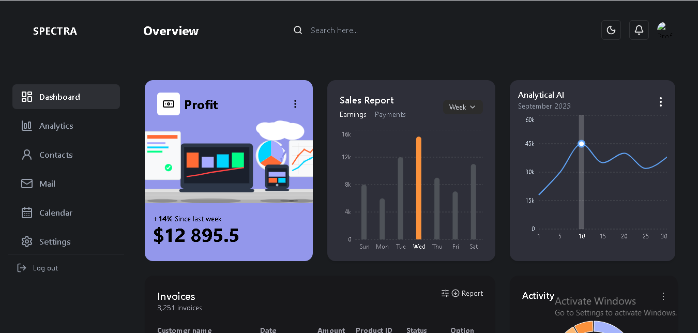
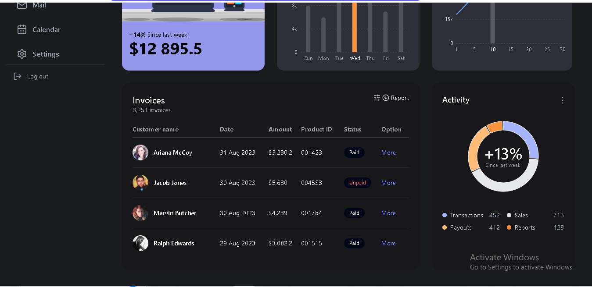

# UI Admin Dashboard – Nexstem Frontend Assignment

A modern, responsive dashboard UI built using **React**, **TypeScript**, and **Tailwind CSS**, inspired by the [Spectra CRM design](https://dribbble.com/shots/22541272-Spectra-CRM-dashboard). This project was created as part of the Frontend Intern assignment.

## 🖼️ Live Demo

**[View Deployed Site](https://nexstem-assignment-ui-dashboard.vercel.app/)**

## 📽️ Preview





## 🎥 Screen Recording

[Click here to view screen recording](https://youtu.be/Aes7CmoYzlY)

---

# 🔧 Setup Instructions

## 1. Clone the repository

git clone https://github.com/AbhishekTiwari14/nexstem-assignment-ui-dashboard

## 2. Install dependencies

npm install

## 3. Start the development server

npm run dev

## 🚀 Deployment

The project is deployed using Vercel.

## 🛠️ Tech Stack

- React with TypeScript

- Tailwind CSS for utility-first styling

- Recharts for charts and graphs

- Native IntersectionObserver for scroll-based animations

- Modular component structure

## 📦 Features

Responsive layout (desktop → tablet → mobile)

Custom UI components (no UI libraries used)

Animated pie chart and bar chart interactions

Hover and animation effects for interactivity

Modular & clean file organization

All data managed via useState and simulated fetches

## 📁 Project Structure

```text
src/
├── components/         # Reusable components (Charts, Tables, etc.)
├── api/                # Mock data fetching functions
├── types/              # TypeScript type definitions
├── App.tsx             # Main layout
└── index.tsx           # Entry point

```

## 🤔 Notes & Decisions

Used Tailwind CSS for styling speed and consistency.

Avoided all UI libraries (e.g., MUI, AntD) as per instructions.

Used IntersectionObserver for scroll-triggered animations instead of animation libraries.

Data is loaded via mock fetchData() functions and managed with useState.

Designed components mobile-first and layered up for larger breakpoints.

## ✅ Requirements Checklist

| Requirement                        | Implemented |
| ---------------------------------- | ----------- |
| React + TypeScript                 | ✅          |
| Tailwind CSS                       | ✅          |
| No UI libraries                    | ✅          |
| Responsive design                  | ✅          |
| State management with hooks        | ✅          |
| Custom components (charts, tables) | ✅          |
| UI interactivity / animation       | ✅          |
| Hosted demo + README               | ✅          |

## 📄 License

This project is for educational/demo purposes and is not intended for production use.

## 👋 Acknowledgments

Design reference:
Spectra CRM Dashboard – Dribbble

```

```
